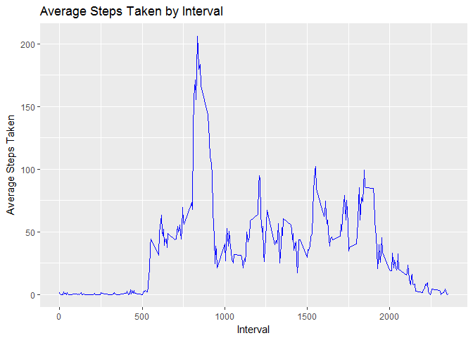

# Reproducible Research: Peer Assessment 1
## Overview

This analysis will evaluate data collected from a personal monitoring device.  The data tracks an anonymous subject's steps taken by day in five minute increments.  There are two months worth of data collected from October to November 2012.

## Loading and preprocessing the data

The following code will load the libraries I will use and then load the data into the dataframe d1. Then, I'll create a subset of d1 that excludes records with NA values called d2.


```r
# load libraries

library(dplyr)
```

```
## 
## Attaching package: 'dplyr'
```

```
## The following objects are masked from 'package:stats':
## 
##     filter, lag
```

```
## The following objects are masked from 'package:base':
## 
##     intersect, setdiff, setequal, union
```

```r
library(ggplot2)
library(DMwR)
```

```
## Loading required package: lattice
```

```
## Loading required package: grid
```

```r
# Get Data

d1<-read.csv(unz("activity.zip", "activity.csv"))

# create a vector of complete cases

good<-complete.cases(d1)

# keep only complete cases

d2<-d1[good,]
```

## What is mean total number of steps taken per day?

This first block of code will create a data frame (d3) that summarized the steps taken by date.


```r
# summarize to steps taken by day

d3<-d2 %>%
  group_by(date) %>%
  summarize(steps=sum(steps))
```

This second block of code will plot a histogram of steps by day using the summarized data frame (d3).


```r
plot1<-ggplot(data=d3, aes(d3$steps)) + geom_histogram(binwidth = 2500, col="black", fill="blue")
plot1<-plot1+labs(x="Steps", y="Count of Days", title="Histogram of Steps per Day")

plot1
```

<!-- -->

Now, I will calculate and displsy the mean and median steps by day


```r
options(scipen = 999)

stepmean<-round(mean(d3$steps),0)

stepmedian<-median(d3$steps)
```

The mean of steps taken is 10766

The median of steps taken is 10765


## What is the average daily activity pattern?

This block of code will create another new data frame (d3) that summarizes steps taken by interval.


```r
# summarize by avg steps taken by interval

d4<-d2 %>%
  group_by(interval) %>%
  summarize(steps=mean(steps))
```

Next, I will plot the average steps by interval.


```r
plot2<-ggplot(d4, aes(x=interval, y=steps))+geom_line(col="blue")+
  labs(x="Interval", y="Average Steps Taken", title="Average Steps Taken by Interval")

plot2
```

<!-- -->

Now, we will find the interval with most steps taken


```r
max<-max(d4$steps)

maxint<-subset(d4, steps==max)
```

The interval with the most steps taken is interval #835, which is equivalent to 8:35am.

## Imputing missing values

First we will calculate how many records in the original data frame (d1) have missing values.
 

```r
# Calculate number of rows with NA's

NAnumb<-nrow(d1)-nrow(d2)
```

There are 2304 records with missing values

Next, I'll use the knnImputation() function from the DMwR package to impute the missing values.  I'll then summarize the imputed data by date.


```r
d6<-knnImputation(d1, k=5)

d7<-d6 %>%
  group_by(date) %>%
  summarize(steps=sum(steps))
```

Now, I'll plot a histogram of steps by day using the imputed data


```r
plot3<-ggplot(data=d7, aes(d7$steps)) + geom_histogram(binwidth = 2500, col="black", fill="blue")
plot3<-plot1+labs(x="Steps", y="Count of Days", title="Histogram of Steps per Day - Imputed N/A")

plot3
```

<!-- -->

We can see that this histogram is very similar to the one generated with the N/A values excluded.

Now we'll see how much the imputing changed the mean and median number of steps taken by day


```r
impstepmean<-mean(d7$steps)

impstepmedian<-median(d7$steps)
```

Imputing the missing data Changes the average daily steps by -220

Imputing the missing data changes the median by -194


## Are there differences in activity patterns between weekdays and weekends?

First, I'll create a new factor variable called DayType that will indicate whether a given date is a weekend day or a weekday.  Then we will summarize the data by Interval and DayType.


```r
# Convert date column to actual dates

d6$date<-as.Date(d6$date)

# add column for day of week

d6$weekday<-weekdays(d6$date)

# combine weekdays into weekend or weekday

d6<-mutate(d6, DayType = ifelse(test = weekday=="Saturday" | weekday=="Sunday", yes="Weekend", no="Weekday"))

# convert Daytype to factor

d6$DayType<-as.factor(d6$DayType)

d8<-d6 %>%
  group_by(DayType, interval) %>%
  summarize(steps=mean(steps))
```

# plot avg steps by interval

plot4<-ggplot(d8, aes(x=interval, y=steps))+geom_line(col="blue")+
  labs(x="Interval", y="Average Steps Taken", title="Average Steps Taken by Interval: Weekday vs. Weekend")+
  facet_grid(DayType~.)

plot4

```
