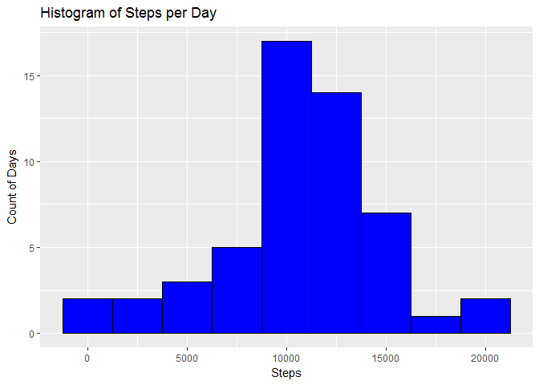
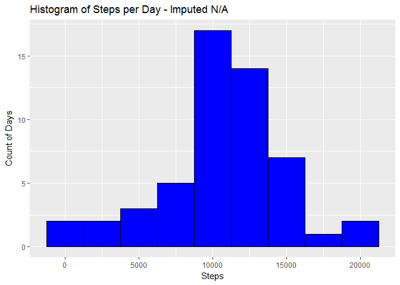
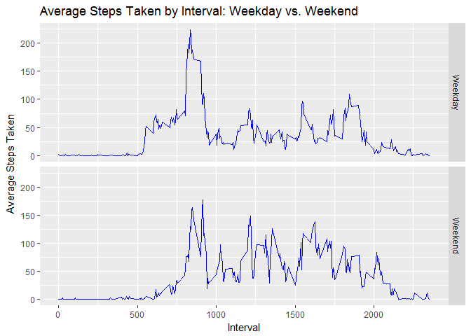

# Reproducible Research: Peer Assessment 1
## OVerview

This analysis will evaluate data collected from a personal monitoring device.  The data tracks an anonymous subject's steps taken by day in five minute increments.  There are two months worth of data collected from October to November 2012.

## Loading and preprocessing the data

The following code will load the libraries I will use and then load the data into the dataframe d1. Then, I'll create a subset of d1 that excludes records with NA values called d2.


```r
# load libraries

library(dplyr)
```

```
## 
## Attaching package: 'dplyr'
```

```
## The following objects are masked from 'package:stats':
## 
##     filter, lag
```

```
## The following objects are masked from 'package:base':
## 
##     intersect, setdiff, setequal, union
```

```r
library(ggplot2)
library(DMwR)
```

```
## Loading required package: lattice
```

```
## Loading required package: grid
```

```r
# Get Data

d1<-read.csv(unz("activity.zip", "activity.csv"))

# create a vector of complete cases

good<-complete.cases(d1)

# keep only complete cases

d2<-d1[good,]
```

## What is mean total number of steps taken per day?


```r
# summarize to steps taken by day

d3<-d2 %>%
  group_by(date) %>%
  summarize(steps=sum(steps))

# Histogram of steps by day

plot1<-ggplot(data=d3, aes(d3$steps)) + geom_histogram(binwidth = 2500, col="black", fill="blue")
plot1<-plot1+labs(x="Steps", y="Count of Days", title="Histogram of Steps per Day")

plot1
```

<!-- -->

```r
# mean and median steps by day

stepmean<-mean(d3$steps)

stepmedian<-median(d3$steps)

stepmean
```

```
## [1] 10766.19
```

```r
stepmedian
```

```
## [1] 10765
```


## What is the average daily activity pattern?


```r
# summarize by avg steps taken by interval

d4<-d2

d5<-d4 %>%
  group_by(interval) %>%
  summarize(steps=mean(steps))

# plot avg steps by interval

plot2<-ggplot(d5, aes(x=interval, y=steps))+geom_line(col="blue")+
  labs(x="Interval", y="Average Steps Taken", title="Average Steps Taken by Interval")

plot2
```

<!-- -->

```r
# find interval with most steps taken

max<-max(d5$steps)

maxint<-subset(d5, steps==max)

maxint$interval
```

```
## [1] 835
```


## Imputing missing values


```r
# Calculate number of rows with NA's

NAnumb<-nrow(d1)-nrow(d2)

NAnumb
```

```
## [1] 2304
```

```r
# Impute NAs with knn

d6<-knnImputation(d1, k=5)

d7<-d6 %>%
  group_by(date) %>%
  summarize(steps=sum(steps))

# Histogram of steps by day

plot3<-ggplot(data=d7, aes(d7$steps)) + geom_histogram(binwidth = 2500, col="black", fill="blue")
plot3<-plot1+labs(x="Steps", y="Count of Days", title="Histogram of Steps per Day - Imputed N/A")

plot3
```

<!-- -->

```r
# mean and median steps by day

impstepmean<-mean(d7$steps)

impstepmedian<-median(d7$steps)

impstepmean
```

```
## [1] 10545.98
```

```r
impstepmedian
```

```
## [1] 10571
```


## Are there differences in activity patterns between weekdays and weekends?


```r
# Convert date column to actual dates

d6$date<-as.Date(d6$date)

# add column for day of week

d6$weekday<-weekdays(d6$date)

# combine weekdays into weekend or weekday

d6<-mutate(d6, DayType = ifelse(test = weekday=="Saturday" | weekday=="Sunday", yes="Weekend", no="Weekday"))

# convert Daytype to factor

d6$DayType<-as.factor(d6$DayType)

d8<-d6 %>%
  group_by(DayType, interval) %>%
  summarize(steps=mean(steps))

# plot avg steps by interval

plot4<-ggplot(d8, aes(x=interval, y=steps))+geom_line(col="blue")+
  labs(x="Interval", y="Average Steps Taken", title="Average Steps Taken by Interval: Weekday vs. Weekend")+
  facet_grid(DayType~.)

plot4
```

<!-- -->
